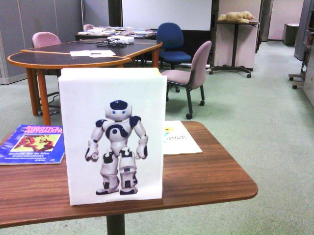
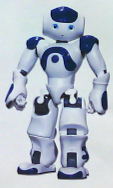

## Dependencies
- Python 2.7
- OpenCV 2

## Getting Start 
- getImage.py: this function captures an image from the robot's cammera and saving it in the current directory.
- detectFeaturesObject: this function was integrated with ALMotionProxy, ALVideoDevice to let robot turning arround (360 degrees) searching for target using RGB data and approaching target at appropriate distance based on size of visual target (in pixels)
  - Input parameters:	
   	- Action parameters: directory path to reference target image, mathching threshold (e.g. apar = "RefImage_1.png" + " 8")
   	- Cultural parameters: size of target (in pixels), speed of approaching target (e.g. cpar = "800" + " 0.2")
  - Output parameters:
   	- Return 1 when target was reached
	
## Running
- Printing the target_1 (target_1.pdf) as A4 size, setting it as the target

- Capturing the image, saving with the name file Image_1:

      python getImage.py --name Image1

- Remove the cluttered backgound by cropping the image region of interest, saving the cropped image as RefImage_1.png

- Executing the action detectFeaturesObject to let the robot approach the target_1:

      python detectFeaturesObject.py

## License
[Apache License 2.0](http://www.apache.org/licenses/LICENSE-2.0)

