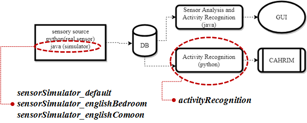

# README

The codes present in this folder represent the modules/functionalities according to the following architecture:

The objective of the "sensor simulator" is to insert into the data base sensor data in a situation which the physical device or the sensor network is not available.

The activity recognition module run independently of the sensor source. Can be called as a thread by a python module (CHARIM for example). The recognition modules runs on real time, and check the sensor database every second. The recognized activity is inserted into the activity database ( there are different tables for different layouts).

Any necessary changes in the layout ( even the inclusion of new ones) does not require much time.

Here are the steps necessary to run the code:

* 1) Instal java virtual machine. Install netbeans to solve all the java pre-requisites;
All the necessary libraries and packages are present inside the lib folder.

* 2) Instal mysql server and mysqladmin.
    https://dev.mysql.com/downloads/windows/installer/5.7.html

* 3) Create the schema "sensor_simulator" using the command "CREATE SCHEMA sensor_simulator" inside the mysql workbench ;
 
* 4) To run the simulator, choose between 3 different layouts (sensorSimulator_default , sensorSimulator_englishBedroom, sensorSimulator_englishComoon). In each folder, there is a file named "database.prop.txt". Open it, and change it according to the username and password set for your mysql server. There is no changes needed for the first and second lines of the "database.prop.txt".

* 5) To run the simulator simply click twice in the jar file or run it from the terminal using "java - jar sensorSimulator_englishComoon.jar" for the layout english common room.

* 6) To run the recognition inside the activityRecognition folder, run the activityRecognition.py code. Copy the class activityRecognition(Thread): inside the activityRecognition.py in order to use it inside another python code. Change the file "database_recognition.txt" according to the setting of your mysql server. The last line in the ""database_recognition.txt" contains the "layout" which will inform to the code the desired layout for recognition. Plese use:
For default layout use "layout:default"
For english bedroom use "layout:englishBedroom"
For english common room use "layout:englishCommon"

The file "activityInfo_layout" contains the list of all activities that are recognizable inside that one specific layout. For example, the file "activityInfo_englishBedroom.txt" contins the list of activities that can be recognized inside the layout english bedroom. Any new activityes can be inserted.

The file "conditionalFile_layout.txt" contains the condition for the activities to be recognized inside a specific layout (i.e. following the conditional matrix approach). Any changes in the recognition can be done inside this file 

--- >>> It is also present in this code the functionality to track the user location according to a specific sensor activation, according to the file "locationInfo_layoutNAME". The first column of this file specify the name of the sensor, and the second the location associate with that sensor. For example, for the input (S1:bed) in the if "locationInfo_layoutNAME", means the sensor "s1" is the pressure sensor in the bed, and whenever this sensor is activated, the code will indentify the user as located at the "bed". If the user is alone in the room, the PIR sensor can also represent the user location. 
